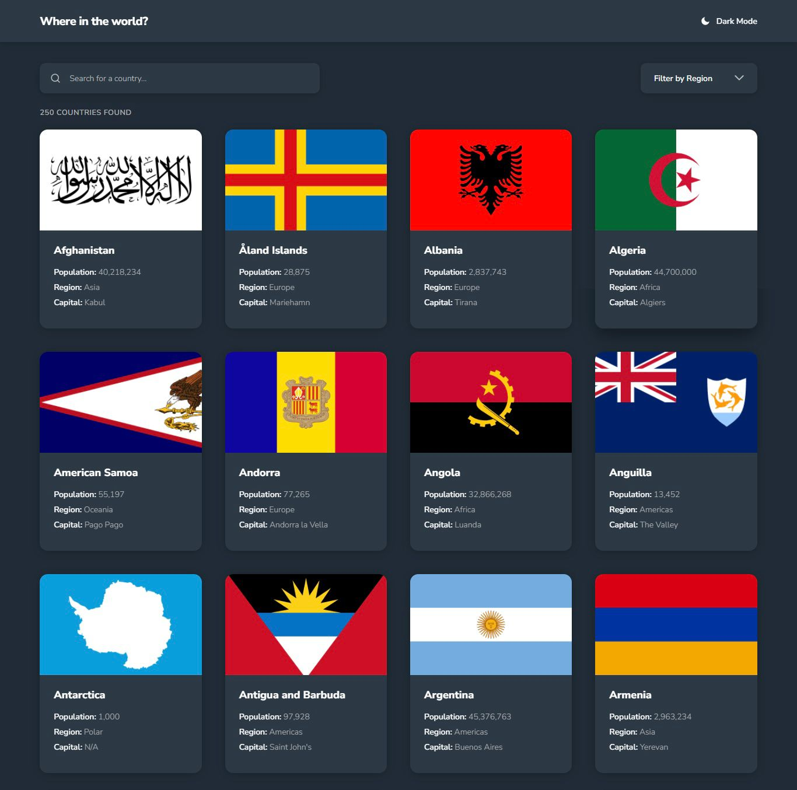

# Frontend Mentor - REST Countries API with color theme switcher solution

This is my solution to the [REST Countries API with color theme switcher challenge on Frontend Mentor](https://www.frontendmentor.io/challenges/rest-countries-api-with-color-theme-switcher-5cacc469fec04111f7b848ca). Frontend Mentor challenges help you improve your coding skills by building realistic projects. The project focuses on building a responsive UI that allows users to explore country data with filtering, searching, and theme switching.

## Table of contents

- [Overview](#overview)
  - [The challenge](#the-challenge)
  - [Screenshot](#screenshot)
  - [Links](#links)
- [My process](#my-process)
  - [Built with](#built-with)
  - [What I learned](#what-i-learned)
  - [Continued development](#continued-development)
  - [Useful resources](#useful-resources)
- [Author](#author)
- [Acknowledgments](#acknowledgments)

## Overview

### The challenge

Users should be able to:

- See all countries from the API on the homepage
- Search for a country using an `input` field
- Filter countries by region
- Click on a country to see more detailed information on a separate page
- Click through to the border countries on the detail page
- Toggle the color scheme between light and dark mode *(optional)*

### Screenshot




### Links

- Solution URL: [Add solution URL here](https://your-solution-url.com)
- Live Site URL: [Add live site URL here](https://your-live-site-url.com)

## My process

### Built with

- Semantic HTML5 markup
- CSS custom properties (variables)
- Flexbox
- CSS Grid
- Vanilla Javascript (modular structure)
- Mobile-first workflow
- REST Countries dataset (data.json)

### What I learned

This project helped me improve my understanding of structuring a real-world frontend application without using a framework.

One key thing I learned was how to separate logic into reusable modules instead of writing everything in one file. For example:

```js
export function getCountriesByName(countries, query) {
  if (!query || !query.trim()) return countries;

  const q = query.trim().toLowerCase();

  return countries.filter((country) => {
    return (
      country.name.toLowerCase().includes(q) ||
      (country.capital || '').toLowerCase().includes(q)
    );
  });
}
```
I also improved my understanding of:

- Managing UI state (search + region filter together)
- Building a custom dropdown instead of relying on <select>
- Handling theme switching using localStorage
- Structuring CSS into global styles and page-specific styles
- Matching designs pixel-perfectly across desktop and mobile (especially 375px)

### Continued development

In future projects, I want to focus on:

- Improving UI consistency and spacing accuracy
- Writing cleaner and more scalable CSS architecture
- Adding accessibility improvements (ARIA roles, keyboard navigation)

### Useful resources

- [Frontend Mentor challenge page](https://www.frontendmentor.io/challenges/rest-countries-api-with-color-theme-switcher-5cacc469fec04111f7b848ca)
- REST Countries API documentation 
- [CSS Grid and Flexbox documentation on MDN](https://developer.mozilla.org/en-US/docs/Learn_web_development/Core/CSS_layout)

### Author

- Website - [Ismail Akande](https://github.com/Officialsammy2701)
- Frontend Mentor - [@Officialsammy2701](https://www.frontendmentor.io/profile/Officialsammy2701)
- Twitter - [@sammy_2701](https://x.com/sammy_2701)

### Acknowledgments

This project was built as part of my frontend development practice.
Special thanks to Frontend Mentor for providing high-quality real-world challenges.
